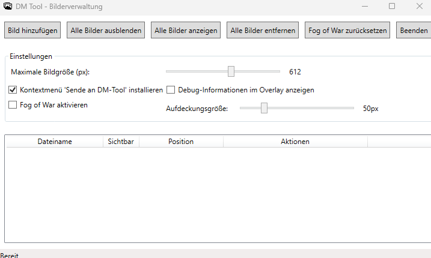

# DMTool

DMTool is a Windows application designed for dungeon masters and game masters to enhance tabletop role-playing game sessions. The tool helps you manage and display images on a secondary screen (TV as battlemap) while providing game master-specific features like Fog of War.

## Features

### Dual-Screen Management
- **Main Window**: Control center for managing all images and settings
- **Overlay Window**: Automatically displays on a secondary monitor for your players to view

### Image Management
- Drag and drop image files directly into the application
- Add multiple images through the file browser
- Show/hide specific images individually
- Remove images individually or all at once
- Random positioning and rotation of images when added

### Fog of War
- Selectively reveal portions of your maps to players
- Customizable reveal size for precise control
- Reset fog option to start fresh
- Works with any image you load

### Additional Features
- System tray integration to run in the background
- Windows Explorer context menu integration ("Send to DM-Tool")
- Persistent settings between sessions
- Debug information display for troubleshooting

## System Requirements

- Windows operating system
- .NET 8.0 Runtime
- Dual monitor setup recommended (but works with single monitor)

## Installation

1. Download the latest release from the [Releases](https://github.com/yourusername/DMTool/releases) page
2. Extract the ZIP file to your preferred location
3. Run `DMTool.exe` to start the application

No installation required - the application is portable.

## Usage

### Basic Operation

1. Launch DMTool
2. Add images using the "Add Image" button or drag and drop files
3. Images automatically appear on the secondary display
4. Use checkboxes to show/hide specific images
5. Click "Reposition Image" to randomly move and rotate an image
6. Minimize the window to keep the tool in the system tray

### Using Fog of War

1. Enable "Fog of War" in the settings section
2. Adjust the reveal size slider to set the size of your "eraser"
3. On the player screen, left-click and drag to reveal portions of the map
4. Click "Reset Fog of War" button to cover everything again

### Windows Explorer Integration

1. Enable "Install Explorer context menu" option
2. Right-click on any supported image file in Windows Explorer
3. Select "Send to DM-Tool" to automatically load the image

## Building from Source

### Prerequisites
- Visual Studio 2022 or later
- .NET 8.0 SDK

### Steps
1. Clone the repository
2. Open DMTool.sln in Visual Studio
3. Build the solution using Build > Build Solution
4. Run the application using Debug > Start Debugging

## License

This project is licensed under the MIT License - see the [LICENSE](LICENSE) file for details.

## Acknowledgments

- Built using WPF (Windows Presentation Foundation)
- Uses [Hardcodet.NotifyIcon.Wpf](https://github.com/hardcodet/wpf-notifyicon) for system tray functionality

## Contributing

Contributions are welcome! Please feel free to submit a Pull Request.

1. Fork the repository
2. Create your feature branch (`git checkout -b feature/amazing-feature`)
3. Commit your changes (`git commit -m 'Add some amazing feature'`)
4. Push to the branch (`git push origin feature/amazing-feature`)
5. Open a Pull Request
